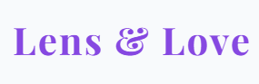

# ProjektFemi - Lens & Love Photography

## 1. Projektbeschreibung
Das Projekt umfasst eine Webseite für ein fiktives Fotografen-Paar ("Lens & Love"), das sich auf Hochzeiten und Porträts spezialisiert hat. Die Seite bietet potenziellen Kunden die Möglichkeit, das Paar kennenzulernen und ihr Portfolio in einer responsiven Raster-Galerie zu betrachten. Javascript wird verwendet, um die Webseite dynamischer zu gestalten.

## 2. Wireframes
See `wireframe.drawio` for the Graphical XML interface.

## 3. Styleguide

- **Logo:** 
- **Farbschema:** 
  - Hintergrund Dunkel (Standard): `#0F0A19` (Tiefes Schwarz-Violett)
  - Hintergrund Hell (Toggle): `#F8F7FA` (Zartes Creme-Weiss)
  - Primär/Akzent 1: `#8B5CF6` (Kräftiges, modernes Violett)
  - Sekundär/Akzent 2: `#F59E0B` (Warmes Bernstein/Gold, komplementär)
  - Text: `#E2E8F0` im Dark Mode, `#1E293B` im Light Mode
- **Typographie:** 
  - Überschriften: `Playfair Display` (Elegant, Serif)
  - Fließtext: `Inter` (Klar, Sans-Serif)
- **Layout-Abstände:**
  - Standard-Padding (Sektionen): `4rem` (py-16) (Y-Achse), `2rem` (px-8) (X-Achse)
  - Gap (Grid/Flex): `1.5rem` (ca. 24px, gap-6 tailwind)

## 4. Link zur Seite
- https://fewa-og.github.io/lens_-_love/index.html
